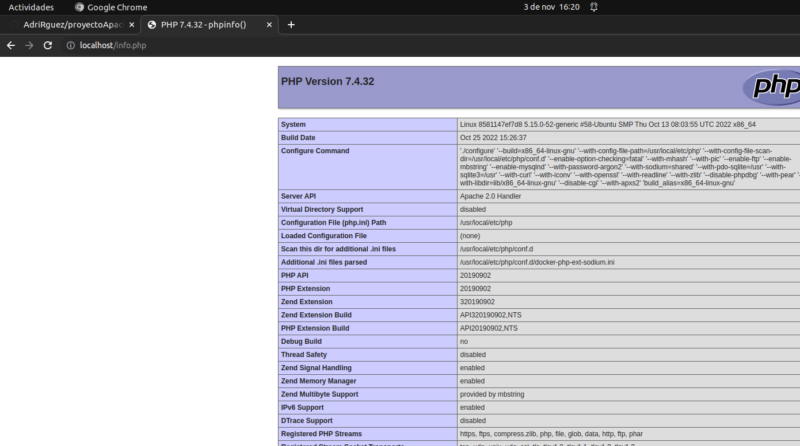
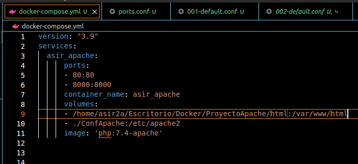
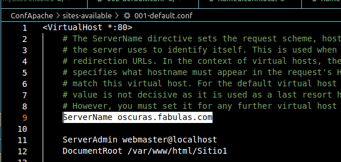

# proyecto Apache
Primero creamos el arbol de directorios: ConfApache y despues la carpeta HTML donde vamos a guardar el fichero html y php.

## docker compose
Ahora creamos el docker compose a partir de la imagen de Apache con PHP, a traves de la imagen redactamos el docker-compose.yml.


~~~
"Docker-compose.yml"
version: "3.9"
 services:
  asir_apache:
      ports:
      - 80:80
      container_name: asir_apache
      volumes:
      - /home/asir2a/Escritorio/Docker/ProyectoApache/html:/var/www/html
      - ConfApache:/etc/apache2
      image: 'php:7.4-apache'   
~~~
En el volumen del docker-compose le indicamos la ruta donde vamos a crear el volumen del HTML

## html
Creamos la carpeta y creamos el fichero llamado index.html y le escribimos "Hola Mundo".

### Comprobacion HTML y PHP
Hacemos un docker-compose up y escribimos en el buscador localhost:80 .

**Resultado HTML:**


Y repetimos el proceso creando el fichero info.php y escribimos una funcion en el fichero.

**Resultado PHP:**



**Configuracion Puertos en el compose**
Añadimos el puerto 8000 y el volumen ConfApache en el docker compose



**Creacion ficheros de configuracion desde contenedor**
Fui al contenedor, con el iniciado y le di a Attach en Visual Code, me meti en la carpeta de /var/www/html y puse el comando a2ensite 002-default, pero antes fui al volumen y copie todos los ficheros en la carpeta ConfApache y añadi el puerto con el comando:(Listen 8000) en fichero ports.conf, tambien duplique el fichero de la carpeta "Sites-Available" y despues fue cuando aplique los comandos que mencione antes.
Para terminar la configuracion de los puertos me fui a los sitios default y le cambie el VirtualHost por el indicado del Sitio.

***Configuracion Cliente y DNS en el docker-compose***
Para configurar el Cliente y el DNS tendremos que bajarnos las imagenes del "Alpine y Bind9", despues ponerle ip fija al DNS y ponerle al Cliente que el DNS apunte al Bind9, despues creamos los volumenes de la configuracion del DNS y nos aseguramos de que toda la configuracion este correctamente escrita.
~~~
version: "3.9"
services:
  asir_apache:
      ports:
      - 80:80
      - 8000:8000
      networks:
        bind_subnet:
          ipv4_address: 10.2.0.254
      container_name: asir_apache
      volumes:
      - /home/asir2a/Escritorio/Docker/ProyectoApache/html:/var/www/html
      - ./ConfApache:/etc/apache2
      image: 'php:7.4-apache'
  bind9:
    container_name: asir_bind9
    image: internetsystemsconsortium/bind9:9.16
    ports:
    - 5300:53/udp
    - 5300:53/tcp
    networks:
      bind_subnet:
       ipv4_address: 10.2.0.3
    volumes:
    - /home/asir2a/Escritorio/Docker/ProyectoApache/ConfigDNS/Config:/etc/bind
    - /home/asir2a/Escritorio/Docker/ProyectoApache/ConfigDNS/Zonas:/var/lib/bind
  asir_cliente:
    container_name: asir_cliente
    image: alpine
    networks:
      - bind_subnet
    stdin_open: true
    tty: true
    dns:
      - 10.2.0.3
networks:
  bind_subnet:
    external: true 
~~~

**Configuracion del db.fabulas.com**
Escribiremos el NS para que apunte a la IP del DNS y despues el dominio de oscuras.fabulas.com  a la IP del Servidor Apache, y el CNAME que apunte a oscuras.fabulas.com
~~~
$TTL    3600   
@       IN      SOA     ns.fabulas.com. adrian.danielcastelao.org. (
                   2022051001           ; Serial
                         3600           ; Refresh [1h]
                          600           ; Retry   [10m]
                        86400           ; Expire  [1d]
                          600 )         ; Negative Cache TTL [1h]
;
@       IN      NS      ns.fabulas.com.
ns      IN      A       10.2.0.3
oscuras      IN      A       10.2.0.254
maravillosas   IN      CNAME   oscuras
~~~

Despues iniciaremos los contenedores y haremos un attach en el cliente y intentaremos hacer ping a la IP y al dominio.


Tambien cambiaremos los ficheros de configuracion del sitio "001-default.conf" la parte donde pone "ServerName " y lo descomentaremos y añadiremos el dominio del sitio 1 y 2.


# Añadir SSL

Primeramente comprobamos que en el fichero [```ports.conf```](https://github.com/ndiazdossantos/proyectoApache/blob/master/confApache/ports.conf) que el  puerto **:443** (el propio de SSL) esté habilitado.

Posteriormente accedemos mediante "Atach shell" presionando click derecho en nuestro contenedor apache y escribimos en el terminal el siguiente comando para habilitar el SSL:

```s
$ a2enmod ssl
```

Nos indicará que debemos eliminar diferentes ficheros de nuestra configuración local (la que mapeamos) de [**```mods-enabled```**](https://github.com/ndiazdossantos/proyectoApache/tree/master/confApache/mods-enabled) que debemos eliminar ya que solo son necesarias las del propio volumen de apache (reiniciamos el servicio cada vez que eliminamos).

Creamos una carpeta dentro de [```confApache```](https://github.com/ndiazdossantos/proyectoApache/blob/master/confApache/) llamada [**```certs```**](https://github.com/ndiazdossantos/proyectoApache/tree/master/confApache/certs) donde generaremos el certificado con el comando:


```s
openssl req -new -newkey rsa:4096 -x509 -sha256 -days 365 -nodes -out apache-certificate.crt -keyout apache.key
```

En el especificaremos todos los parámetros que se nos indica, se generarán dos archivos, uno denominado ```apache-certificate.crt``` y ```apache.key```, por seguridad github no nos dejará subir dichos ficheros.


Posteriormente dentro de nuestra carpeta [**```html```**](https://github.com/ndiazdossantos/proyectoApache/tree/master/html) creamos una nueva llamada [**```SSL```**](https://github.com/ndiazdossantos/proyectoApache/tree/master/html/ssl) donde almacenaremos un [**```index.html```**](https://github.com/ndiazdossantos/proyectoApache/blob/master/html/ssl/index.html) para comprobar finalmente el funcionamiento de nuestro SSL.

Para habilitar el SSL del virtualhost utilizaremos los siguientes comandos:

```s
$ a2ensite ssl
$ a2ensite default-ssl
```

 
Seguidamente vamos al fichero de configuración [**```default.ssl.conf```**](https://github.com/ndiazdossantos/proyectoApache/blob/master/confApache/sites-available/default-ssl.conf) en [```sites-available```](https://github.com/ndiazdossantos/proyectoApache/tree/master/confApache/sites-available) y especificaremos en el DocumentRoot la ruta de nuestro directorio que tendrá el SSL (Línea 12) y las rutas de nuestros dos archivos del certificado que hemos generado (Linea 32 y Linea 33).

```xml
<IfModule mod_ssl.c>
	<VirtualHost _default_:443>
		ServerAdmin webmaster@localhost

		DocumentRoot /var/www/html/ssl

		# Available loglevels: trace8, ..., trace1, debug, info, notice, warn,
		# error, crit, alert, emerg.
		# It is also possible to configure the loglevel for particular
		# modules, e.g.
		#LogLevel info ssl:warn

		ErrorLog ${APACHE_LOG_DIR}/error.log
		CustomLog ${APACHE_LOG_DIR}/access.log combined

		# For most configuration files from conf-available/, which are
		# enabled or disabled at a global level, it is possible to
		# include a line for only one particular virtual host. For example the
		# following line enables the CGI configuration for this host only
		# after it has been globally disabled with "a2disconf".
		#Include conf-available/serve-cgi-bin.conf

		#   SSL Engine Switch:
		#   Enable/Disable SSL for this virtual host.
		SSLEngine on

		#   A self-signed (snakeoil) certificate can be created by installing
		#   the ssl-cert package. See
		#   /usr/share/doc/apache2/README.Debian.gz for more info.
		#   If both key and certificate are stored in the same file, only the
		#   SSLCertificateFile directive is needed.
		SSLCertificateFile	/etc/apache2/certs/apache-certificate.crt
		SSLCertificateKeyFile /etc/apache2/certs/apache.key

		#   Server Certificate Chain:
		#   Point SSLCertificateChainFile at a file containing the
		#   concatenation of PEM encoded CA certificates which form the
		#   certificate chain for the server certificate. Alternatively
		#   the referenced file can be the same as SSLCertificateFile
		#   when the CA certificates are directly appended to the server
		#   certificate for convinience.
		#SSLCertificateChainFile /etc/apache2/ssl.crt/server-ca.crt

		#   Certificate Authority (CA):
		#   Set the CA certificate verification path where to find CA
		#   certificates for client authentication or alternatively one
		#   huge file containing all of them (file must be PEM encoded)
		#   Note: Inside SSLCACertificatePath you need hash symlinks
		#		 to point to the certificate files. Use the provided
		#		 Makefile to update the hash symlinks after changes.
		#SSLCACertificatePath /etc/ssl/certs/
		#SSLCACertificateFile /etc/apache2/ssl.crt/ca-bundle.crt

		#   Certificate Revocation Lists (CRL):
		#   Set the CA revocation path where to find CA CRLs for client
		#   authentication or alternatively one huge file containing all
		#   of them (file must be PEM encoded)
		#   Note: Inside SSLCARevocationPath you need hash symlinks
		#		 to point to the certificate files. Use the provided
		#		 Makefile to update the hash symlinks after changes.
		#SSLCARevocationPath /etc/apache2/ssl.crl/
		#SSLCARevocationFile /etc/apache2/ssl.crl/ca-bundle.crl

		#   Client Authentication (Type):
		#   Client certificate verification type and depth.  Types are
		#   none, optional, require and optional_no_ca.  Depth is a
		#   number which specifies how deeply to verify the certificate
		#   issuer chain before deciding the certificate is not valid.
		#SSLVerifyClient require
		#SSLVerifyDepth  10

		#   SSL Engine Options:
		#   Set various options for the SSL engine.
		#   o FakeBasicAuth:
		#	 Translate the client X.509 into a Basic Authorisation.  This means that
		#	 the standard Auth/DBMAuth methods can be used for access control.  The
		#	 user name is the `one line' version of the client's X.509 certificate.
		#	 Note that no password is obtained from the user. Every entry in the user
		#	 file needs this password: `xxj31ZMTZzkVA'.
		#   o ExportCertData:
		#	 This exports two additional environment variables: SSL_CLIENT_CERT and
		#	 SSL_SERVER_CERT. These contain the PEM-encoded certificates of the
		#	 server (always existing) and the client (only existing when client
		#	 authentication is used). This can be used to import the certificates
		#	 into CGI scripts.
		#   o StdEnvVars:
		#	 This exports the standard SSL/TLS related `SSL_*' environment variables.
		#	 Per default this exportation is switched off for performance reasons,
		#	 because the extraction step is an expensive operation and is usually
		#	 useless for serving static content. So one usually enables the
		#	 exportation for CGI and SSI requests only.
		#   o OptRenegotiate:
		#	 This enables optimized SSL connection renegotiation handling when SSL
		#	 directives are used in per-directory context.
		#SSLOptions +FakeBasicAuth +ExportCertData +StrictRequire
		<FilesMatch "\.(cgi|shtml|phtml|php)$">
				SSLOptions +StdEnvVars
		</FilesMatch>
		<Directory /usr/lib/cgi-bin>
				SSLOptions +StdEnvVars
		</Directory>

		#   SSL Protocol Adjustments:
		#   The safe and default but still SSL/TLS standard compliant shutdown
		#   approach is that mod_ssl sends the close notify alert but doesn't wait for
		#   the close notify alert from client. When you need a different shutdown
		#   approach you can use one of the following variables:
		#   o ssl-unclean-shutdown:
		#	 This forces an unclean shutdown when the connection is closed, i.e. no
		#	 SSL close notify alert is send or allowed to received.  This violates
		#	 the SSL/TLS standard but is needed for some brain-dead browsers. Use
		#	 this when you receive I/O errors because of the standard approach where
		#	 mod_ssl sends the close notify alert.
		#   o ssl-accurate-shutdown:
		#	 This forces an accurate shutdown when the connection is closed, i.e. a
		#	 SSL close notify alert is send and mod_ssl waits for the close notify
		#	 alert of the client. This is 100% SSL/TLS standard compliant, but in
		#	 practice often causes hanging connections with brain-dead browsers. Use
		#	 this only for browsers where you know that their SSL implementation
		#	 works correctly.
		#   Notice: Most problems of broken clients are also related to the HTTP
		#   keep-alive facility, so you usually additionally want to disable
		#   keep-alive for those clients, too. Use variable "nokeepalive" for this.
		#   Similarly, one has to force some clients to use HTTP/1.0 to workaround
		#   their broken HTTP/1.1 implementation. Use variables "downgrade-1.0" and
		#   "force-response-1.0" for this.
		# BrowserMatch "MSIE [2-6]" \
		#		nokeepalive ssl-unclean-shutdown \
		#		downgrade-1.0 force-response-1.0

	</VirtualHost>
</IfModule>

# vim: syntax=apache ts=4 sw=4 sts=4 sr noet

```

Al modificar dicho archivo posteriormente reiniciamos el contenedor de apache. Por último para poder comprobar en nuestro localhost el SSL debemos habilitar en el contenedor el puerto **443** desde el [```docker-compose.yml```](https://github.com/ndiazdossantos/proyectoApache/blob/master/docker-compose.yml).

```yml
services:
  apache:
    container_name: apachePHP
    image: php:7.2-apache
    networks:
      bind9_subnet:
        ipv4_address: 10.1.0.253
    ports:
      - '80:80'
      - '8000:8000'
      - '443:443'
  
    volumes:
      - ./html:/var/www/html
      - ./confApache:/etc/apache2
```

Ejecutamos un:

```s
$ docker-compose down -v
$ docker-compose up
```
Y si entramos en nuestro buscador y realizamos la consulta ```https://localhost/``` ya nos saltará nuestro certificado, eso sin sin validar ya que lo hemos generado nosotros mismos.

__


# Añadir Wireshark

Para ello añadimos a nuestro [```docker-compose.yml```](https://github.com/ndiazdossantos/proyectoApache/blob/master/docker-compose.yml):

```yml
  wireshark:
    image: lscr.io/linuxserver/wireshark:latest
    container_name: wireshark
    cap_add:
      - NET_ADMIN
    security_opt:
      - seccomp:unconfined #optional
    environment:
      - PUID=1000
      - PGID=1000
      - TZ=Europe/London
    volumes:
      - ./wireshark:/config
    ports:
      - 3000:3000 #optional
    restart: unless-stopped
```
Creamos una carpeta llamada ```wireshark``` que es en donde mapearemos el volumen como indicamos en el [```docker-compose.yml```](https://github.com/ndiazdossantos/proyectoApache/blob/master/docker-compose.yml) y posteriormente ejecutamos:

```s
$ docker-compose down -v
$ docker-compose up
```

Y si probamos a acceder desde ```https://localhost:3000``` podemos comprobar que ya tenemos nuestro **Wireshark** funcionando.


__

# Añadir autentificación

Para añadir la autentificación primero crearemos una carpeta denominada [**```pass```**](https://github.com/ndiazdossantos/proyectoApache/tree/master/confApache/pass) dentro de [**```confApache```**](https://github.com/ndiazdossantos/proyectoApache/tree/master/confApache).

Una vez creada entraremos al contenedor Apache haciendo click derecho en ```Atach-Shell```, una vez dentro ejecutaremos el comando:

```
 htpasswd /etc/apache2/pass/password noe
```

En el fichero que indicamos en dicha ruta se guardará una contraseña cifrada que nosotros previamente indiquemos por pantalla, vinculado al usuario que indicamos.

Posteriormente accedemos a [```default-ssl.conf```](https://github.com/ndiazdossantos/proyectoApache/blob/master/confApache/sites-available/default-ssl.conf) donde modificaremos el fichero añadiendiendo el siguiente trozo de código siguiendo el [```Tutorial```](https://httpd.apache.org/docs/2.4/mod/core.html#directory):

```xml

		<Directory /var/www/html/ssl>
		AuthType Basic
		AuthName "Restricted Files"
		AuthUserFile /etc/apache2/pass/password
		Require user noe
		</Directory> 

```

Donde indicamos en ```Directoy``` la ruta de nuestro sitio, posteriormente en ```AuthUserFile``` la ruta de nuestro fichero con la password cifrada y por último modificamos el ```Require user``` indicando nuestro usuario.

Realizamos un **restart** del contenedor de Apache y ya podemos comprobar su funcionamiento.

__


[README.md](README.md) de Noé Díaz Dos Santos para el repositorio [Proyecto Apache](https://github.com/ndiazdossantos/proyectoApache)
