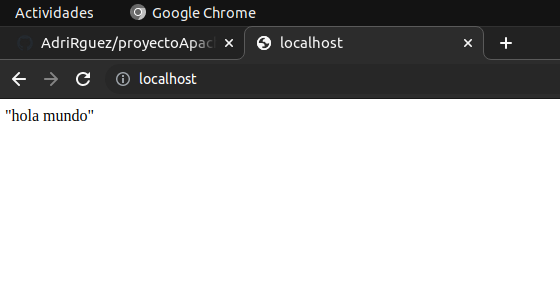

# proyecto Apache
Primero creamos el arbol de directorios: ConfApache y despues la carpeta HTML donde vamos a guardar el fichero html y php.

## docker compose
Ahora creamos el docker compose a partir de la imagen de Apache con PHP, a traves de la imagen redactamos el docker-compose.yml.

~~~
"Docker-compose.yml"
version: "3.9"
 services:
  asir_apache:
      ports:
      - 80:80
      container_name: asir_apache
      volumes:
      - /home/asir2a/Escritorio/Docker/ProyectoApache/html:/var/www/html
      - ConfApache:/etc/apache2
      image: 'php:7.4-apache'   
~~~
En el volumen del docker-compose le indicamos la ruta donde vamos a crear el volumen del HTML

## html
Creamos la carpeta y creamos el fichero llamado index.html y le escribimos "Hola Mundo".

### Comprobacion HTML y PHP
Hacemos un docker-compose up y escribimos en el buscador localhost:80 .

**Resultado HTML:**

Y repetimos el proceso creando el fichero info.php y escribimos una funcion en el fichero.

**Resultado PHP:**

**Configuracion Puertos en el compose**
Añadimos el puerto 8000 y el volumen ConfApache en el docker compose

**Creacion ficheros de configuracion desde contenedor**
Fui al contenedor, con el iniciado y le di a Attach en Visual Code, me meti en la carpeta de /var/www/html y puse el comando a2ensite 002-default, pero antes fui al volumen y copie todos los ficheros en la carpeta ConfApache y añadi el puerto con el comando:(Listen 8000) en fichero ports.conf, tambien duplique el fichero de la carpeta "Sites-Available" y despues fue cuando aplique los comandos que mencione antes.
Para terminar la configuracion de los puertos me fui a los sitios default y le cambie el VirtualHost por el indicado del Sitio.

